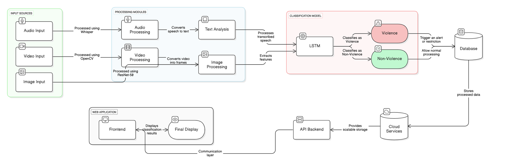
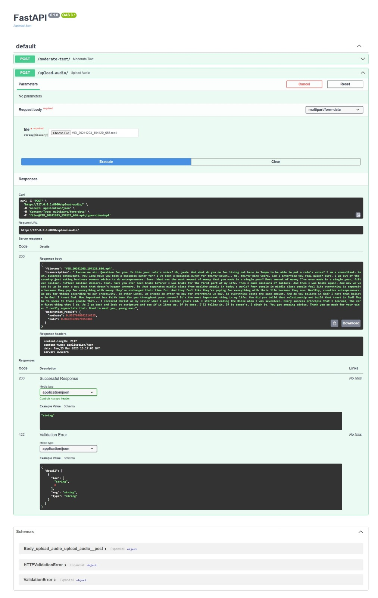
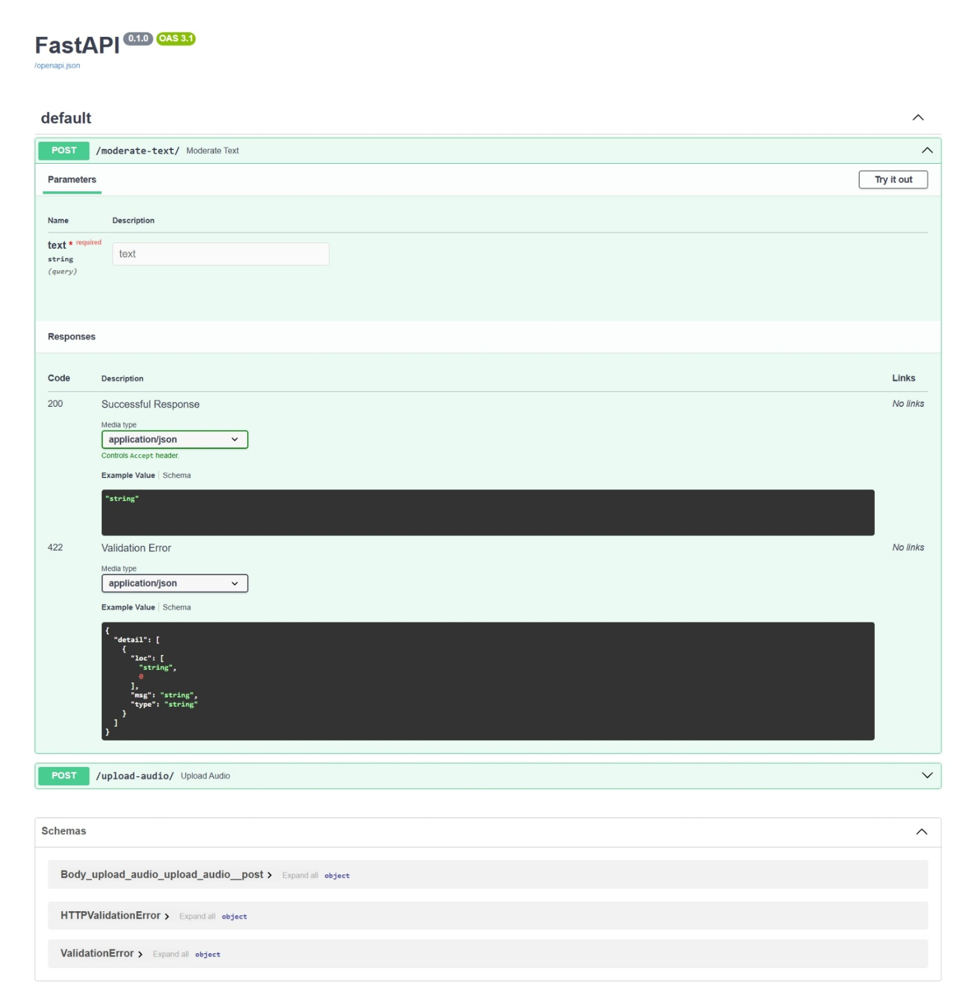

# 🚨 Scaling Trust: AI-Powered Detection of Online Harms

*👥 Team:* Innovate X  
*Team Leader:* David Jayaraj A

---

## 📌 Problem Statement
*Scaling Trust: AI-Powered Detection of Online Harms*

With the rise of user-generated content, moderating harmful content on platforms like Facebook and Instagram has become increasingly important. This project introduces a real-time, multimodal AI moderation system that analyzes videos before they are posted to detect hate speech, misinformation, cyberbullying, and violent content.

---

## 🧠 Overview of the Solution

Our AI-powered content moderation tool uses *multimodal learning* (text, audio, and video) to identify offensive material and prevent it from going public. The system delivers fast and accurate predictions through lightweight, optimized models and provides an intuitive review dashboard for moderators.

---

## 🌟 Unique Selling Proposition (USP)

- *Multimodal AI Moderation:* Combines NLP, CV, and ASR for comprehensive analysis.
- *Real-time Content Flagging:* Prevents harmful uploads before they go live.
- *Smart Labeling System:* Automatically tags flagged content with categories.

---

## 🚀 Features

### Text Moderation
- Uses BERT-based NLP models to identify *hate speech, **cyberbullying, and **misinformation*.

### Video Moderation
- Leverages *YOLO* for object detection to identify *weapons or violent visuals*.

### Audio Moderation
- Integrates *Whisper* model to transcribe and classify speech in videos.

### Real-time Labeling
- Labels and tags flagged videos with the *type of violation*.

### Admin Dashboard
- Moderators can review content, understand the flagged reasons, and make decisions.

### User Feedback System
- Notifies users why their content was flagged and educates them about *community guidelines*.

---
## 🏗 Architecture

The system processes each modality (*text, image, and audio) separately, then consolidates the results for a final classification. It includes a **user interface* for moderation and user notifications, powered by a robust *backend*.

---

## 🧰 Technologies Used

| Domain         | Technology                      |
|----------------|----------------------------------|
| Text Analysis  | RoBERTa, BERT                    |
| Video Analysis | OpenCV, ResNet-50, YOLO          |
| Audio Analysis | Whisper                          |
| Backend        | FastAPI, Node.js                 |
| Frontend       | React.js                         |
| Cloud          | Google Cloud                     |
| Database       | PostgreSQL                       |

---

## 🔗 Links

- *GitHub Repository:* [https://github.com/Klassy01/Solution]
- *Demo Video:* [https://drive.google.com/drive/folders/1vbBmWBSHB4donErYnpyH3_-_KwiT55Re] 
- *MVP Link:* [https://sociify.netlify.app/] 

---

## 📈 Future Development

- Integration with *Gemini APIs* for enhanced content understanding.
- *Live stream moderation* for real-time content control.
- *User appeal system* to allow feedback and dispute resolution.

---

## 📸 Snapshots

MVP snapshots available in the presentation slides.

---
snapshots of model classification available in the presentation slides.

Thank you for exploring our solution to scale trust in digital communities.